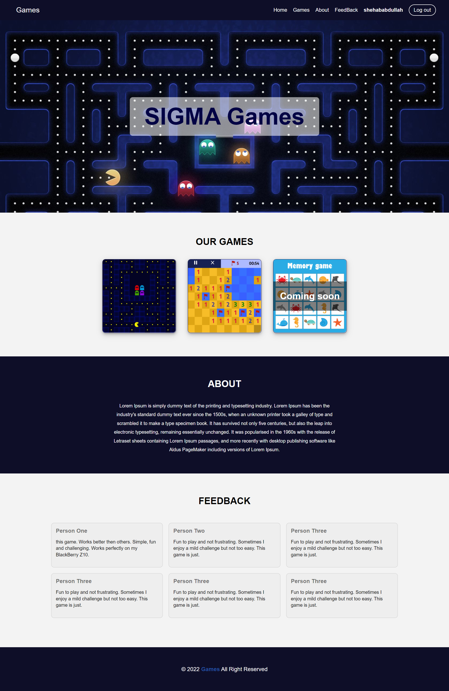
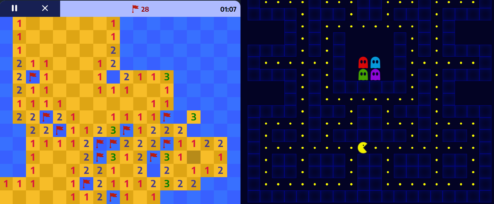

## what is sigma
[**SIGMA games**](https://festive-perlman-02c89b.netlify.app/index.html) is a website that hosts some simple games
where you can have some fun playing them.
all the games are single player so you can play whenever you want and you don't have to wait anyone to play with you

## Our Games

 1. **Minesweeper:** 
The game is about finding all bombs hidden in the board following the numbers on the board, **you can learn more about how to play the game** [here](https://www.instructables.com/How-to-beat-Minesweeper/). The game has 3 levels:
	- Easy: board (8 x 10) and contains 10 bombs
	- Medium: board (14 x 18) and contains 40 bombs
	- Hard: board (20 x 24) and contains 99 bombs
		 
 2. **Pacman:** is a well-known game about a little yellow creature stands alone in a maze full of ghosts looking for anything to eat. his mission is to collect all gold in the maze so he can open the gate to join his family.  Our hero dies if at any moment he exists in a square which contains a ghost.

> Minesweeper board is generated randomly so you can never expect where the bombs are except if you play with the game rules
> Ghosts in pacman are also moving randomly 

[go to SIGMA>>](https://festive-perlman-02c89b.netlify.app/index.html)

## screenshots
**Watch the video for the website** [**here**](https://drive.google.com/file/d/1riX8Z257ruejn8X_18_DezJxH_88USnP/view?usp=sharing)

## tools
 - HTML
 - CSS 
 - Javascript

## developers

 - Me (Shehab el-deen Abdullah)
 - Hossam Ramadan 
 - Mohammed Abu-elkassem
 
## ToDo
 - Add more games
 - make a dashboard to show top players

 

